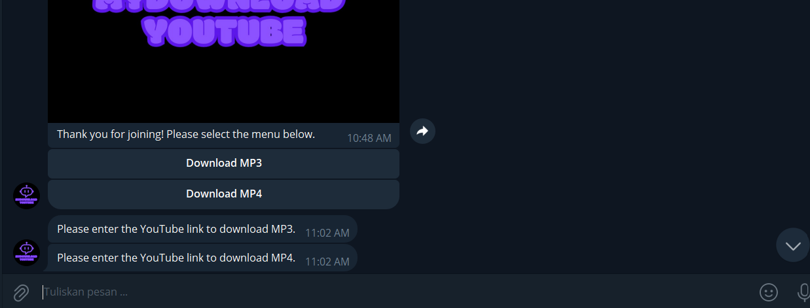

# BOT FER

A simple and versatile Telegram bot for various tasks.

## About

BOT FER is a Telegram bot designed to perform various tasks, including downloading YouTube videos, managing channel memberships, and providing useful information to users.

## Key Features

- YouTube video downloader
- Membership management for Telegram channels
- Customizable response to user queries
- Multilingual support

## How to Use

To use BOT FER, follow these steps:

1. Join the designated Telegram channel.
2. Start the bot and follow the instructions provided.
3. Use the available commands to perform tasks such as downloading videos or managing memberships.

## Images

Add some images or screenshots of your project here to provide a visual representation of what you've created.

## Contributions

If you'd like to contribute to this project, please open an issue or submit a pull request.

## License

This project is licensed under the [BOT-FER]

